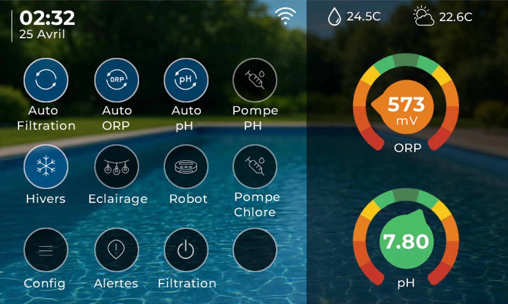
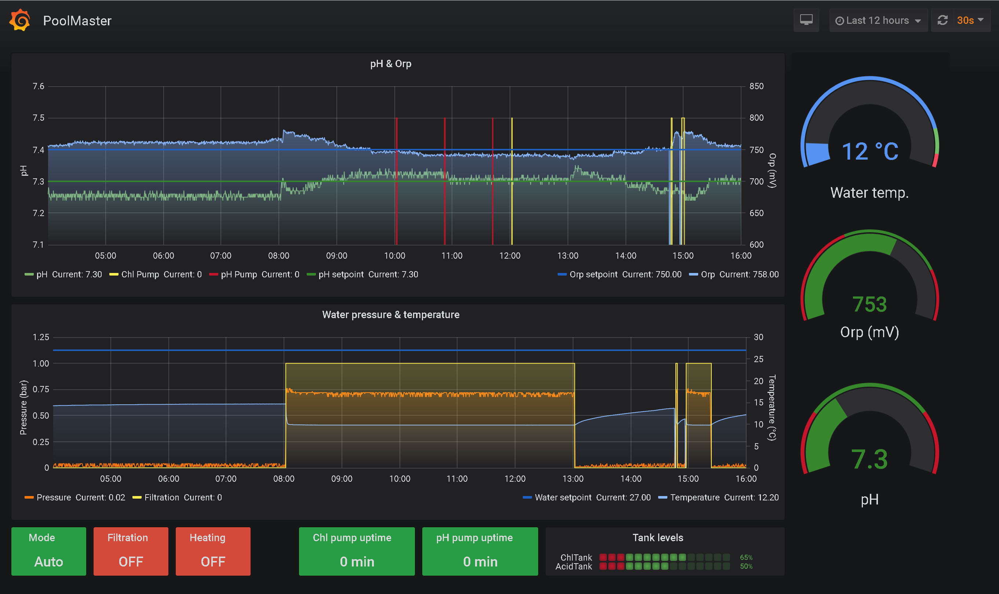

# Flow.IO

## Afficheur Raspberry Pi

Le dossier [`rpi-kiosk`](rpi-kiosk/) contient un paquet autonome pour
transformer un Raspberry Pi 3B+ sous Raspberry Pi OS Lite 32 bits en afficheur
tactile Flow.io. L'installation configure Chromium en mode kiosk, le démarrage
automatique et la mise en veille de l'écran.

## Version Waveshare Qwiic 2.3.0

Cette edition allegee cible exclusivement le Waveshare ESP32-S3 avec modules
Qwiic/I2C. Les profils, modules, simulations et interfaces Nextion des autres
produits ont ete retires; `Waveshare-ESP32-S3` est le seul environnement
PlatformIO pris en charge par ce paquet.

### Version 2.3.0

- Profil materiel `ESP32-S3-WROOM-1-N16R8` : flash 16 Mo et PSRAM octale 8 Mo.
- Nouvelle planification de filtration calculee a partir de la temperature de
  l'eau, centree sur 15 h, avec cycle nocturne de 2 h sous 12 degres et
  fonctionnement continu a partir de 30 degres.
- La temperature est moyennee apres cinq minutes de filtration pour calculer
  le cycle suivant; le plan est conserve apres redemarrage.
- Journal d'activite persistant et capture paginee des logs de demarrage,
  consultables dans la page Diagnostics.
- Home Assistant utilise un selecteur unique pour choisir `desactive`,
  `electrolyseur` ou `chlore_liquide`; les entites sans rapport avec le mode
  choisi sont retirees automatiquement.
- Ecritures OTA decoupees avec restitution reguliere du processeur et scripts
  de regeneration des ressources Web disponibles sous Linux et Windows.
- Suppression complete du transport d'ecran distant HMI UDP et du port 42110.
- Limitation des echecs Digest renforcee contre les attaques multi-sources.
- Recuperation physique des acces Web par cavalier `GPIO21`-`GND`, avec point
  d'acces temporaire et verrouillage des relais.
- Firmware et SPIFFS recompiles avec la version `2.3.0` integree.
- Le firmware d'ecran Nextion reste en `2.0.7`, car son contenu n'a pas change.
- Le travail restant avant production est consigne dans [RESTANT_A_FAIRE.md](RESTANT_A_FAIRE.md).

### Nouveaute 2.0.7

- Deux retours de contacteurs par carte optocouplee 24 V vers 3,3 V.
- Retour filtration sur `GPIO8` / entree logique `i04`; retour electrolyseur sur `GPIO9` / entree logique `i05`.
- Surveillance activable separement dans `Configuration > PoolLogic > Capteurs` et desactivee par defaut.
- Alarme apres 5 secondes si le contact auxiliaire ne correspond pas a la commande du relais, aussi bien a l'enclenchement qu'au relachement.
- Un defaut du retour contacteur de filtration force l'arret de l'electrolyseur.

### Durcissement de cette edition

- Authentification HTTP Digest obligatoire hors portail de premiere configuration.
- Mot de passe administrateur aleatoire genere au premier demarrage et affiche une fois sur la console serie.
- Mot de passe WPA2 du portail de configuration unique genere au demarrage (ou injecte a la compilation).
- Les mots de passe WiFi, MQTT et Web ne sont plus renvoyes par les API.
- Jeton CSRF aleatoire obligatoire pour les actions HTTP et controle strict de
  l'origine de la console WebSocket.
- En-tetes CSP, anti-clickjacking, anti-MIME-sniffing et politique de
  permissions ajoutes a toutes les reponses HTTP.
- MQTT chiffre et verifie par certificat (`mqtts://`, port `8883`) par defaut.
- Transport d'ecran distant HMI UDP supprime; aucun service n'ecoute le port UDP 42110.
- Limitation Digest durcie : 32 sources suivies, blocage par IP et plafond global.
- MQTT refuse les identifiants vides, limite les rafales de commandes et bloque
  les mises a jour/imports de configuration recus par MQTT.
- Mises a jour reseau non signees refusees par defaut.
- Dependances PlatformIO epinglees, manifeste exhaustif avec SHA-256 et controle de release automatise.

Voir [docs/security-hardening.md](docs/security-hardening.md) pour les details et les limites restantes.
La configuration du compte et des ACL Mosquitto est detaillee dans
[docs/mqtt-hardening.md](docs/mqtt-hardening.md).

### Fonctions de la 2.0.6

- L'interface de mise a jour reste presente, mais les televersements et mises a jour reseau sont bloques dans cette edition tant qu'une chaine de signature de production n'est pas configuree.
- Barre de progression, verification du type de fichier, rapport d erreur et redemarrage automatique.
- Sauvegarde de la configuration complete dans un fichier JSON depuis la page `Mises a Jour`.
- Restauration avec validation du format, confirmation et progression. Les secrets sont volontairement exclus du backup.

Installer le firmware et le SPIFFS par USB. Ne reactiver la mise a jour reseau qu'apres mise en place de Secure Boot v2 et de la verification de signature de tous les formats distribues.

### Fonctions conservees de la 2.0.5

- Affectation persistante des ROM DS18B20 aux roles `Temperature eau` et `Temperature air` depuis la page Diagnostics. Un redemarrage applique la nouvelle affectation.
- Assistant de calibration pH a 1, 2 ou 3 points. Le mode 3 points calcule le meilleur ajustement lineaire compatible avec les coefficients `C0/C1`.
- Calibration ORP a 1 point (offset) ou 2 points, avec reprise de la mesure en direct.
- Diagnostic detaille des capteurs : valeur calculee, entree brute, code ADC, adresse I2C, canal et anciennete de la mesure.
- Configuration du capteur de pression directement en volts et en bars. Reglage propose : `0,4-2,4 V` pour `0-3 bar`, soit `C0=1,5` et `C1=-0,6`.
- Etat reel `ON/OFF` des huit relais affiche et actualise chaque seconde pendant l ouverture de la page Diagnostics.

### Fonctions conservees de la 2.0.4

- Page web `Diagnostics`.
- Checklist de mise en service avec etats Qwiic, DS18B20, reseau et relais.
- Scan I2C Qwiic depuis l'interface web, avec controle des adresses attendues `0x18`, `0x48`, `0x49` et rappel SDA `GPIO42` / SCL `GPIO41`.
- Identification des sondes DS18B20 via DS2484 avec affichage des ROM IDs.
- Diagnostic reseau WiFi/Ethernet avec mode et adresse IP.
- Test manuel temporise des 8 relais Waveshare depuis l'interface web : ON 3 s puis OFF automatique cote firmware.
- Confirmation avant test des relais critiques : filtration, electrolyseur, chauffage.
- Commandes de test via `pooldevice.write`, avec validation du relais `0..7`.
- Bibliotheque `OneWire` locale corrigee pour supprimer les avertissements de compilation ESP32.

### Fichiers a flasher

- `binary/esp32s3-2.3.0.bin` : firmware Waveshare ESP32-S3 N16R8.
- `binary/esp32s3-spiffs-2.3.0.bin` : interface web / SPIFFS.
- `binary/Flowio_Nextion_800x480-v2.0.7.tft` : firmware de l'ecran Nextion 800x480.
- `nextion/src/Flowio_Nextion_800x480_v2_0_7_working.HMI` : source modifiable avec Nextion Editor.

### Adressage I2C

| Adresse | Module | Usage |
| --- | --- | --- |
| `0x48` | ADS1115 carte pH/ORP V3 | ORP en `AIN0-AIN1`, pH en `AIN2-AIN3` |
| `0x18` | DS2484 | Pont I2C vers les DS18B20 eau/air |
| `0x49` | ADS1115 pression | Pression en `AIN0`, sortie en bar |

### Bus Qwiic Waveshare

| Signal | GPIO Waveshare |
| --- | --- |
| SDA | `GPIO42` |
| SCL | `GPIO41` |

### Cavalier de recuperation des acces

Le connecteur du Waveshare expose `GPIO21` a cote d'une broche `GND`; ces deux
broches peuvent recevoir un cavalier amovible. `GPIO21` est reserve a la
recuperation et reste configure en entree avec pull-up interne. Ne jamais lui
appliquer de tension externe.

Procedure:

1. Couper l'alimentation du controleur.
2. Poser le cavalier entre `GPIO21` et `GND`.
3. Remettre sous tension. Le niveau bas doit rester stable pendant `500 ms`.
4. Se connecter au point d'acces ouvert `FlowIO-RECOVERY-xxxxxx`, puis ouvrir
   `http://192.168.4.1/rescue`.
5. Remplacer l'utilisateur et le mot de passe Web; le Wi-Fi et MQTT peuvent
   aussi etre reconfigures si necessaire.
6. Retirer le cavalier avant le redemarrage annonce par l'interface.

La fenetre dure dix minutes. Pendant ce temps, les huit sorties de piscine
restent arretees et les demandes d'allumage sont refusees. Le point d'acces est
volontairement ouvert parce que la possession physique du cavalier constitue
l'autorisation; il ne faut donc pas laisser le cavalier en place. Si aucun
changement n'est effectue, le point d'acces se ferme et le fonctionnement normal
reprend a l'expiration.

### Entrees de surveillance des contacteurs

Les entrees recoivent uniquement le signal logique 3,3 V de la partie sortie de la carte optocouplee. Ne jamais appliquer 24 V directement sur un GPIO Waveshare.

| Equipement surveille | Entree logique | GPIO | Reglage par defaut |
| --- | --- | ---: | --- |
| Contacteur filtration | `i04` | `GPIO8` | active bas, pull-up, surveillance desactivee |
| Contacteur electrolyseur | `i05` | `GPIO9` | active bas, pull-up, surveillance desactivee |

Le contact auxiliaire doit etre ferme lorsque le contacteur est colle. Si la sortie de la carte optocouplee fournit au contraire un niveau haut actif, modifier `i04_active_high` ou `i05_active_high` dans la configuration IO.

### Sorties par defaut

Commande ON = relais commande, commande OFF = relais relache (`activeHigh=true`).

| Relais Waveshare | Sortie logique | Fonction par defaut |
| ---: | --- | --- |
| Relais 1 | `PortExio1` | Pompe filtration via contacteur |
| Relais 2 | `PortExio2` | Pompe pH |
| Relais 3 | `PortExio3` | Pompe chlore / ORP liquide |
| Relais 4 | `PortExio4` | Robot |
| Relais 5 | `PortExio5` | Pompe de remplissage |
| Relais 6 | `PortExio6` | Electrolyseur, de preference via entree contact sec/remote |
| Relais 7 | `PortExio7` | Eclairage |
| Relais 8 | `PortExio8` | Chauffage eau |

### Reconstruction

```powershell
pio run -e Waveshare-ESP32-S3
pio run -e Waveshare-ESP32-S3 -t buildfs
```

Pour une reconstruction reproductible, fixer l'identifiant de build au format
`YYYYMMDD.HHMMSS` dans la variable d'environnement `FLOW_BUILD_REF`. Sans cette
variable, l'horodatage courant reste utilise.

Flow.IO est une plateforme autonome permettant de gérer automatiquement votre piscine: elle automatise la gestion de la qualité de l'eau, réduit les opérations manuelles, et donne une supervision claire des équipements en local comme à distance.


## Pourquoi Flow.IO

Sans orchestration continue, on observe vite:
- dérive pH / ORP
- filtration mal dimensionnée par rapport à la température
- surconsommation de produits et d'énergie
- usure prématurée des pompes et actionneurs
- gestion complexe de l'hivernage

Flow.IO apporte un pilotage cohérent de bout en bout.


## Surveillance et contrôle en continu

Mesure en continu:
- température de l'eau et de l'air
- pression de pompe
- pH
- ORP (redox)
- niveau du bassin
- métriques de fonctionnement des équipements (temps de marche, volumes injectés, niveau cuves)

Actionneurs pilotés:
- pompe de filtration
- pompes péristaltiques pH / chlore liquide
- électrolyse au sel (SWG)
- pompe robot
- pompe de remplissage
- relais auxiliaires (ex: éclairage, chauffage, équipements externes)

## Interface locale tactile

L'interface locale tactile offre une vue synthétique des mesures, états et commandes principales pour l'exploitation quotidienne au bord du bassin.


## Automatisation utile au quotidien

- calcul automatique de la fenêtre de filtration selon la température d'eau
- priorisation et interlock des actionneurs pour une sécurité totale
- gestion des plannings (jour/semaine/mois) persistante
- modes d'exploitation (auto, manuel, protection gel)
- supervision alarmes (pression, états critiques)

## Principe de régulation PID (pH / ORP)

Flow.IO implémente une régulation PID temporelle pour les pompes péristaltiques pH et ORP:
- calcul PID périodique (par défaut toutes les `30 s`)
- conversion de la sortie en durée d'activation `output_on_ms` bornée dans une fenêtre fixe (`window_ms`, typiquement `1 h`)
- commande ON/OFF dans la fenêtre: la pompe est active en début de fenêtre pendant `output_on_ms`

Si les conditions de sécurité ne sont pas réunies (filtration arrêtée, mode hiver, capteur indisponible, défaut pression, etc.), la sortie est remise à `0` et la pompe est coupée.

Détail complet de l'algorithme, des conditions d'activation et des topics runtime dans la documentation module:
- [PoolLogicModule](docs/modules/PoolLogicModule.md)

## Intégration et exploitation

- publication MQTT structurée (`cfg/*`, `rt/*`, `cmd`, `ack`)
- auto-discovery Home Assistant pour le contrôle sur Internet et les statistiques à long terme
- gestion via application mobile entièrement paramétrable (Home Assistant)
- intégration possible avec Jeedom/Node-RED/InfluxDB/Grafana via MQTT
- architecture modulaire robuste (FreeRTOS + services Core + EventBus + DataStore + ConfigStore/NVS)
- Mises a jour OTA prevues par l'architecture, desactivees par defaut dans cette edition durcie

Résultat: une eau plus stable, une maintenance plus prévisible et une meilleure maîtrise des coûts d'exploitation.



## Documentation développeur

La documentation complète (architecture, services Core, flux EventBus/DataStore/MQTT, et fiche détaillée par module) est disponible ici:

- [Documentation complète](docs/README.md)
- [Protocole Flow.IO <-> Supervisor (I2C cfg/status)](docs/core/flow-supervisor-i2c-protocol.md)
- [Quality Gates Modules (notes + description des 10 points)](docs/core/module-quality-gates.md)
- [Durcissement securite](docs/security-hardening.md)

Avant de distribuer un kit, executer:

```powershell
python scripts/verify_release.py
```

## Documentation utilisateur

- [Documentation utilisateurs (PDF)](docs/Documentation%20utilisateur.pdf)

## Licence

Ce firmware est distribue sous la licence GNU General Public License,
version 3 uniquement (`GPL-3.0-only`). Voir [LICENSE](LICENSE).

Les composants tiers conservent leurs droits d'auteur et leurs conditions
de licence propres. Voir [THIRD_PARTY_NOTICES.md](THIRD_PARTY_NOTICES.md).
